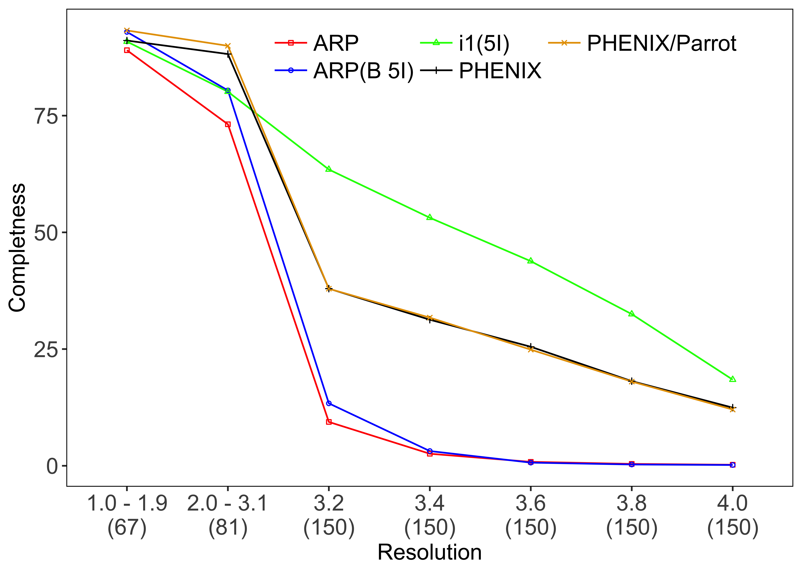
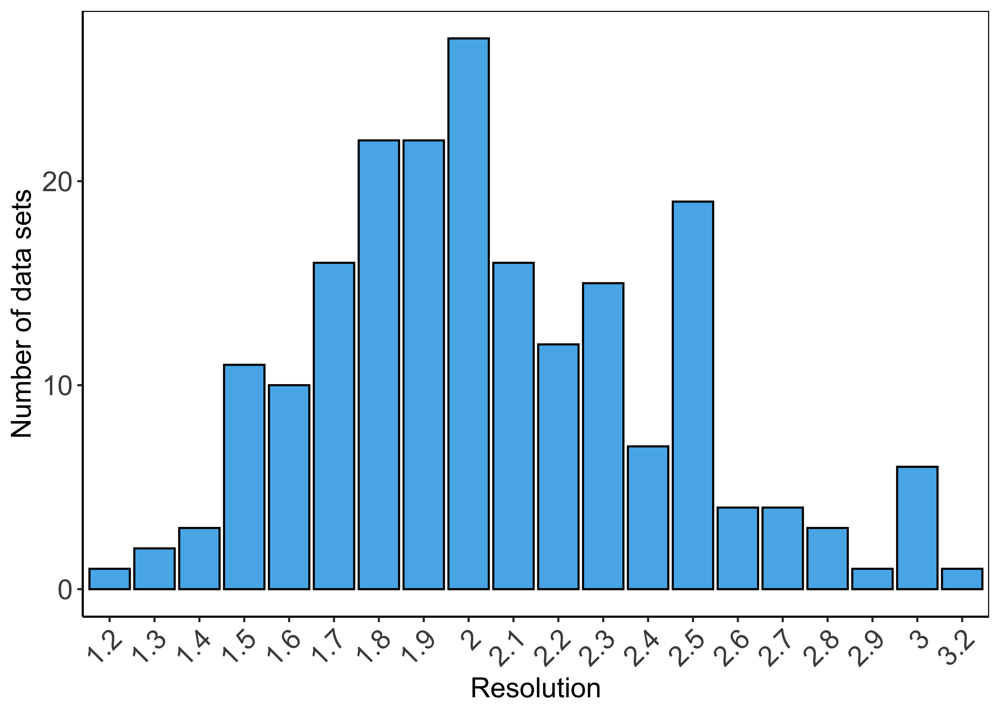
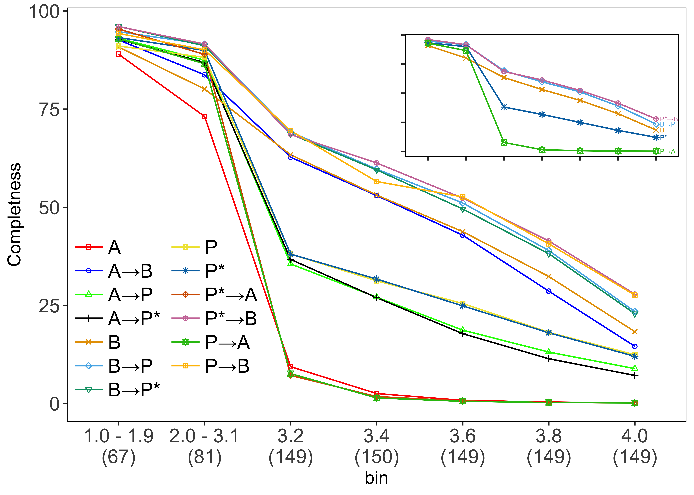
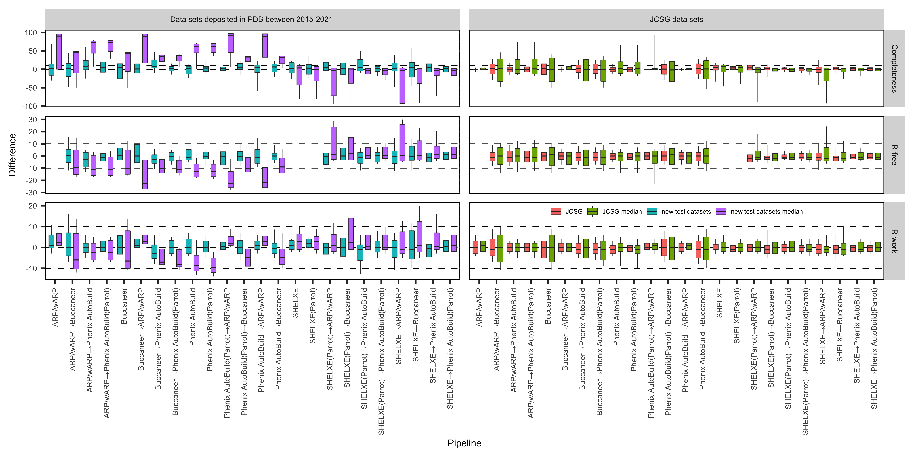
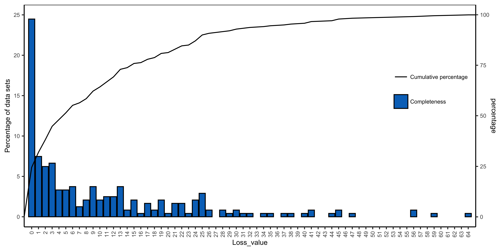

# A bunch of R scripts
These R scripts are those that I used to visualise the results in my research papers. For each script, I show an example of data structure, a produced plot and the command line with parameters, if any, to run the script from the command line. The scripts are free and ready to use.      

## Script 1 (line plot)
<p align="center">

</p>

- Command line
```
Rscript Script1.r -CSV_file Data_example.csv
```
- Command line keywords


  
| Keyword | Description | Default value |
| ------ | ----------- |-----------  |
| -CSV_file   | Path to CSV file. | Data_example.csv |
| -Plot_name | Created plot name | Plot.png |
| -x_label    |  a column name in the CSV file to use for x axis  | Resolution  |
| -y_label    |  a column name in the CSV file to use for y axis | Completness |
| -group_label    |   a column name in the CSV file to group the data  | Pipeline |
| -font_size    |   x and y axis labels fonts size  | 14 |

<a href="/Scripts/Script1/Script1.r" > - Download the script </a>

<a href="/Scripts/Script1/Data_example.csv" > - Download the data example </a>

## Script 2 (histogram plot)
<p align="center">

</p>

- Command line
```
Rscript Script2.r -CSV_file Data_example.csv
```
- Command line keywords


  
| Keyword | Description | Default value |
| ------ | ----------- |-----------  |
| -CSV_file   | Path to CSV file. | Data_example.csv |
| -Plot_name | Created plot name | Plot.png |
| -x_label    |  a column name in the CSV file to use for x axis  | Resolution  |
| -font_size    |   x axis labels fonts size  | 14 |

<a href="/Scripts/Script2/Script2.r" > - Download the script </a>

<a href="/Scripts/Script2/Data_example.csv" > - Download the data example </a>


## Script 3 (bar plots grid)
<p align="center">

</p>

- Command line
```
Rscript Script3.r -CSV_file Data_example.csv
```
- Command line keywords


  
| Keyword | Description | Default value |
| ------ | ----------- |-----------  |
| -CSV_file   | Path to CSV file. | Data_example.csv |
| -Plot_name | Created plot name | Plot.png |
| -x_label    |  a column name in the CSV file to use for x axis  | CompareTo  |
| -y_label    |  a column name in the CSV file to use for y axis | Percentage |
| -group_label    |   a column name in the CSV file to group the data  | Pipeline |
| -font_size    |   y axis labels fonts size  | 14 |

<a href="/Scripts/Script3/Script3.r" > - Download the script </a>

<a href="/Scripts/Script3/Data_example.csv" > - Download the data example </a>


## Script 4 (inset line plot)
<p align="center">

</p>

- Command line
```
Rscript Script4.r -CSV_file Data_example.csv
```
- Command line keywords


  
| Keyword | Description | Default value |
| ------ | ----------- |-----------  |
| -CSV_file   | Path to CSV file. | Data_example.csv |
| -Plot_name | Created plot name | Plot.png |
| -x_label    |  a column name in the CSV file to use for x axis  | bin  |
| -y_label    |  a column name in the CSV file to use for y axis | Completness |
| -group_label    |   a column name in the CSV file to group the data  | Pipeline |
| -font_size    |   x and y axis labels fonts size  | 14 |

To hide a line in the inset plot, set the alpha value for the corresponding line to zero in the plot (g2) in the script. 
```
scale_alpha_manual(values = c(0, 0, 0, 0,1, 1, 0, 0,1, 0, 1, 1,0))
```
<a href="/Scripts/Script4/Script4.r" > - Download the script </a>

<a href="/Scripts/Script4/Data_example.csv" > - Download the data example </a>

## Script 6 (heatmap)
<p align="center">

</p>

- Command line
```
Rscript Script6.r -CSV_file Data_example.csv
```
- Command line keywords


  
| Keyword | Description | Default value |
| ------ | ----------- |-----------  |
| -CSV_file   | Path to CSV file. | Data_example.csv |
| -Plot_name | Created plot name | Plot.png |
| -x_label    |  a column name in the CSV file to use for x axis  | Structure_evaluation  |
| -y_label    |  a column name in the CSV file to use for y axis | Feature |
| -secondary_y_label_1    |   a column name in the CSV file to use for secondary y axis  | Error_matrix |
| -secondary_y_label_2    |   a column name in the CSV file to use for second secondary y axis  | Dataset |
| -secondary_x_label    |   a column name in the CSV file to use for secondary x axis  | Pipeline |
| -fill_value    |   a column name in the CSV file to use to fill in the heatmap cell  | Difference_from_base_model |
| -font_size    |   x and y axis labels fonts size  | 3 |
| -round_places    |   number of places to use when round the heatmap values  | 5 |

<a href="/Scripts/Script6/Script6.r" > - Download the script </a>

<a href="/Scripts/Script6/Data_example.csv" > - Download the data example </a>

## Script 7 (box plot grid)
<p align="center">

</p>

- Command line
```
Rscript Script7.r -CSV_file Data_example.csv
```
- Command line keywords


  
| Keyword | Description | Default value |
| ------ | ----------- |-----------  |
| -CSV_file   | Path to CSV file. | Data_example.csv |
| -Plot_name | Created plot name | Plot.png |
| -x_label    |  a column name in the CSV file to use for x axis  | Pipeline  |
| -y_label    |  a column name in the CSV file to use for y axis | Difference |
| -secondary_y_label    |   a column name in the CSV file to use for secondary y axis  | Evaluation_measure |
| -secondary_x_label    |   a column name in the CSV file to use for secondary x axis  | dataset |
| -group_data    |   a column name in the CSV file to use to fill in the heatmap cell  | predictive_model |
| -font_size    |   x and y axis labels fonts size  | 14 |


<a href="/Scripts/Script7/Script7.r" > - Download the script </a>

<a href="/Scripts/Script7/Data_example.csv" > - Download the data example </a>


## Script 8 (bar with line plot)
<p align="center">

</p>

- Command line
```
Rscript Script8.r -CSV_file Data_example.csv
```
- Command line keywords


  
| Keyword | Description | Default value |
| ------ | ----------- |-----------  |
| -CSV_file   | Path to CSV file. | Data_example.csv |
| -Plot_name | Created plot name | Plot.png |
| -x_label    |  a column name in the CSV file to use for x axis  | Loss_value  |
| -group_data    |   a column name in the CSV file to use to fill in the heatmap cell  | Structure_evaluation |
| -font_size    |   x and y axis labels fonts size  | 8 |


<a href="/Scripts/Script8/Script8.r" > - Download the script </a>

<a href="/Scripts/Script8/Data_example.csv" > - Download the data example </a>

## Citing
```
@software{A_bunch_of_R_scripts,
  author = {Alharbi,Emad},
  doi = {},
  month = {03},
  title = {{A bunch of R scripts}},
  url = {https://github.com/E-Alharbi/rscript-bunch},
  year = {2022}
}
```
